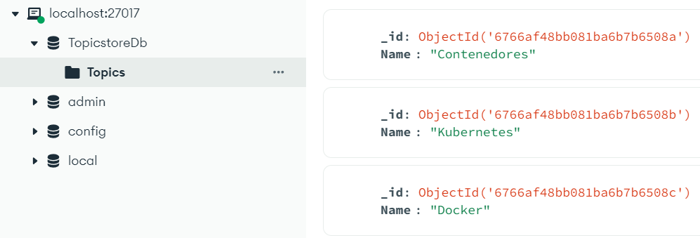
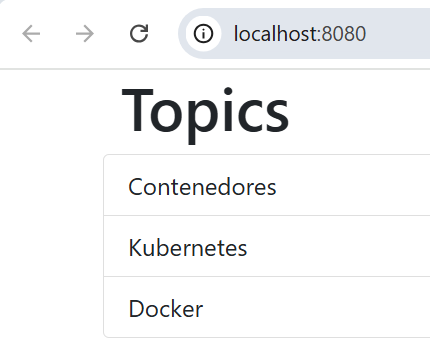

# Laboratorio Contenedores Docker

## Ejercicio 1

Dockeriza la aplicación dentro de [lemoncode-challenge](./), la cual está compuesta de 3 partes:

- Un front-end con Node.js
- Un backend en .NET (`dotnet-stack`) o en Node.js (`node-stack`) que utiliza un MongoDB para almacenar la información.
- El MongoDB donde se almacena la información en una base de datos.

Nota: como has podido comprobar, el directorio `lemoncode-challenge` tiene dos carpetas: `dotnet-stack` y `node-stack`. En ambos casos el frontend es el mismo, sólo cambia el backend. Usa el stack que prefieras.

### Requisitos del ejercicio

1. Los tres componentes deben estar en una red llamada `lemoncode-challenge`.
2. El backend debe comunicarse con el mongodb a través de esta URL `mongodb://some-mongo:27017`.
3. El front-end debe comunicarse con la api a través de `http://topics-api:5000/api/topics`.
4. El front-end debe estar mapeado con el host para ser accesible a través del puerto 8080.
5. El MongoDB debe almacenar la información que va generando en un volumen, mapeado a la ruta `/data/db`.
6. Este debe de tener una base de datos llamada `TopicstoreDb` con una colección llamada `Topics`. La colección `Topics` debe tener esta estructura:

```json
{
  "_id": { "$oid" : "5fa2ca6abe7a379ec4234883" },
  "topicName" : "Contenedores"
}
```

¡Añade varios registros!

```diff
+ ### PROPUESTA EJER 1
```
1. Crear la red llamada `lemoncode.challenge` con comando: `docker network create lemoncode-challenge`
2. Crear el volumen `db_mongo` con comando: `docker volume create db_mongo`
3. Crear un contenedor de mongo con un volumen (db_mongo) `docker run --name some-mongo -v db_mongo:/data/db -p 27017:27017 -d mongo:8.0.3`
4. Creara base de datos `TopicstoreDb` y colección `Topics`. Añadir registros en mongo con el cliente "MongoDbCompass": 
```json 
[
   {"Name": "Contenedores"},
  {"Name": "Kubernetes"},
  {"Name": "Docker"}
] 
```
<p aling="center">

</p>

5. Eliminar contenedor para no tener expuestos los puertos y añadir la red: `docker stop some-mongo` y `docker rm some-mongo`
6. Crearlo de nuevo con la red añadida: `docker run --name some-mongo -v db_mongo:/data/db --network=lemoncode-challenge -d mongo:8.0.3`
7. Dockerización del Backend: `docker build --tag backend-node .`
8. Dockerización del frontend: `docker build --tag frontend-node .`
9. Correr docker backend con variables y red añadida: `docker run -d --name topics-api --network=lemoncode-challenge -e PORT=5000 -e HOST='topics-api' -e DATABASE_URL='mongodb://some-mongo:27017' -e DATABASE_NAME='TopicstoreDb' backend-node`
10. Correr docker frontend con variables,red y puerto 8080 expuesto: `docker run -d --name frontend --network=lemoncode-challenge -p 8080:3000 -e API_URI='http://topics-api:5000/api/topics' frontend-node`
11. Resultado de la operación:
<p aling="center">

</p>

## Ejercicio 2

Ahora que ya tienes la aplicación del ejercicio 1 dockerizada, utiliza Docker Compose para lanzar todas las piezas a través de este. Debes plasmar todo lo necesario para que esta funcione como se espera: la red que utilizan, el volumen que necesita MongoDB, las variables de entorno, el puerto que expone la web y la API. Además debes indicar qué comandos utilizarías para levantar el entorno, pararlo y eliminarlo.

```diff
+ ### PROPUESTA EJER 2
```
1. Crear el docker compose con todos los requerimientos.
2. El volumen es externo donde anteriormente se crearon registron en mongo
3. El enviroment en el repo es `env.template` para seguir las buenas prácticas. Cambiar nombre a `.env` para desarrollo local

4. Comando levantar entorno docker compose: `docker compose up -d --build`
5. Comando parar docker compose: `docker compose stop` 
6. Comando eliminar docker compose: `docker compose down`