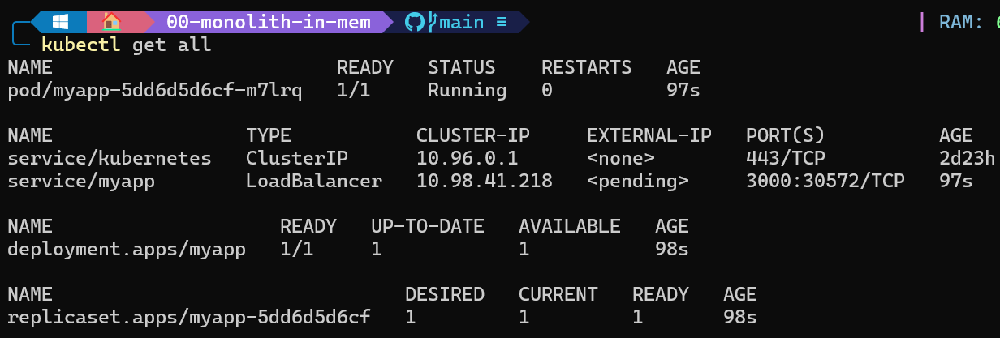
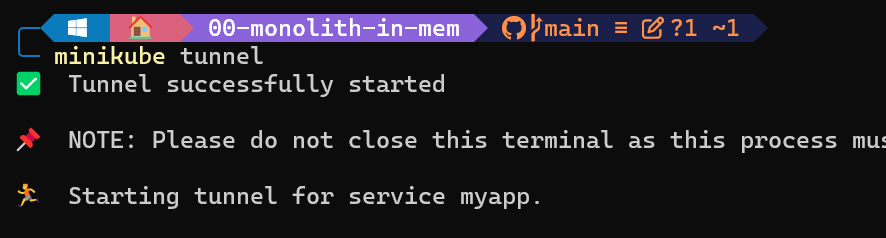
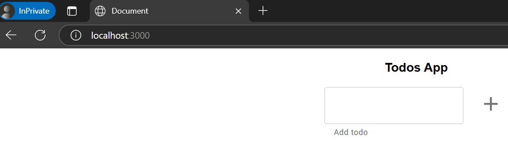

# Monolito en memoria

## Enunciado

Construir los distintos recursos de Kubernetes para generar un clúster, como el de la siguiente imagen:

```diff
+ ### PROPUESTA EJERCICIO DE MONOLITH-IN-MEM
```
1. Creación del fichero YAML `(deployment.yaml)`. Este deployment constará de dos partes relevantes:
 * La parte del deployment que especificará la forma del `replicaset` que manejará los pod con parámetros de cuantas replicas se desea `replicas: 1` y un selector que servirá para relacionar los pods en base a una coincidencia de labels `selecter.matchlabels`
```yaml
apiVersion: apps/v1
kind: Deployment
metadata:
  name: myapp
spec:
  replicas: 1
  selector:
    matchLabels:
      app: myapp
```

 * La parte de `template` que es donde se definirá la especificación del `pod`. Donde se agregan:
    - la imagen que usarán los pods `lemoncodersbc/lc-todo-monolith:v5-2024`
    - las variables de entorno `NODE_ENV` y `PORT`.
    - puerto de escucha del contenedor `containerPort`

```yaml
  template:
    metadata:
      labels:
        app: myapp
    spec:
      containers:
      - name: myapp
        image: lemoncodersbc/lc-todo-monolith:v5-2024
        env:
          - name: NODE_ENV
            value: production
          - name: PORT
            value: "3000"
        ports:
          - containerPort: 3000
```

2. Crear un servicio `(service.yaml)` de tipo LoadBalancer en kubernetes para actue como loadbalancer de los pod seleccionados `selector.app` y también se defina el puerto que expondrá el servicio `ports.port` y el puerto del contenedor de destino que maperá `ports.targetPort`

```yaml
apiVersion: v1
kind: Service
metadata:
  name: myapp
spec:
  type: LoadBalancer
  selector:
    app: myapp
  ports:
  - port: 3000
    targetPort: 3000
```
3. Para la aplicación de los manifiestos definidos se seguirán los siguientes comandos:
```bash
kubectl apply -f deployment.yaml
kubectl apply -f service.yaml
```
Resultado de la ejecución
<p align="center">
    
</p>

4. Como se puede observar, el servicio que hemos creado `myapp` como `External-IP` está pendiente aún. para poder comunicarse con el servicio se sigue la guía de minikube para acceder con el comando:
```bash
minikube tunnel
```
<p align="center">
    
</p>

4. Comprobar el funcionamiento dirigiendose al `External-IP` del servicio que ahora se le ha proporcionado la dirección `127.0.0.1` y puerto `3000`. La aplicación responde correctamente.

<p align="center">
    
</p>