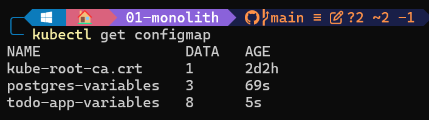
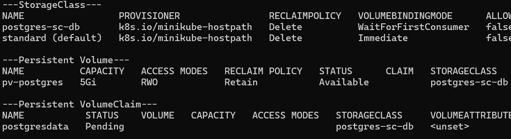
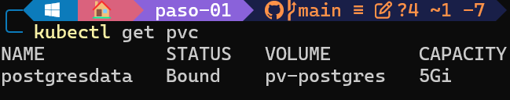
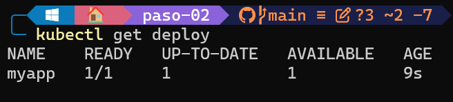
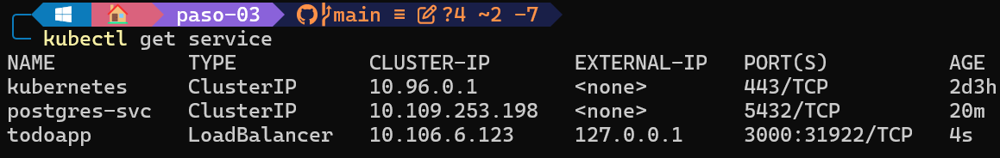
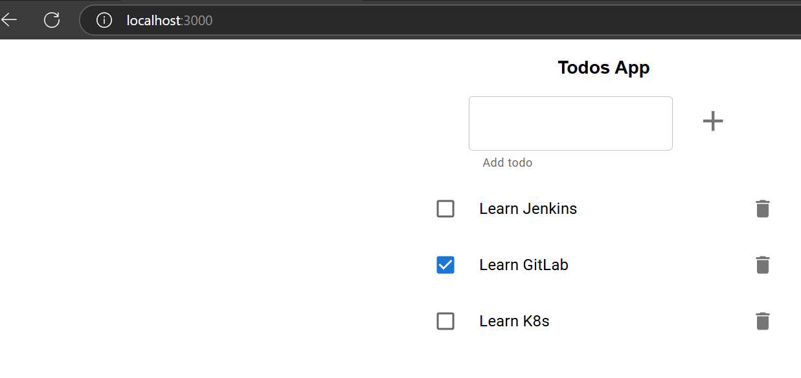

# Monolito

## Enunciado

Construir los distintos recursos de Kubernetes para generar un clúster, como el de la siguiente imagen:

```diff
+ ### PROPUESTA EJERCICIO DE MONOLITH
```

### Paso 1. Crear una capa de persistencia de datos

1. Creación de los confiMap para las variables de Postgres con un manifiesto YAML para las variables necesarias de Postgres `(ConfigMapPostgres.yaml)` y el comando `kubectl apply -f ConfigMapPostgres.yaml`

<p align="center">
    
</p>

2. Creación de una entidad `StorageClass` definido en el archivo `StorageClass.yaml`

3. Creación de una entidad `PersistentVolume` definido en el archivo `PersistentVolume.yaml` que tendrá una propiedad `storageClassName: postgres-sc-db` que haga referencia al anterior StorageClass creado anteriormente

4. Creación de una entidad `PersistentVolumeClaim` definido en el archivo `PersistentVolumeClaim.yaml` que tendrá una propiedad `storageClassName: postgres-sc-db` que haga referencia al anterior StorageClass. Esta vinculación se hará a través del `PersistentVolume`

Resultado de creación de recursos `StorageClass`, `PersistentVolume` y `PersistentVolumeClaim`
<p align="center">
    
</p>

> [!NOTE]
> La parte de `PersistentVolumeClaim` de `postgresdata` el estado aparece como `PENDING` porque el `StorageClass` por defecto crea un la política de `VOLUMEBINDINGMODE` como `WaitForFirstConsumer` que indica que la vinculación se hará una vez haya algún `pod` que haga uso.

5. Creación del StatefulSet en `StatefulSet.yaml`. La entidad `StatefulSet` servirá para mantener aplicaciones con estado porque se crea un volumen por cada `pod` , al contrario de las entidades `Deployment` o `Replicaset` que comparten un mismo volumen.

También este mismo hará referencia al anterior `PersistentVolumeClaim` creado anteriormente
```yaml
      volumes:
        - name: postgresdb
          persistentVolumeClaim:
            claimName: postgresdata
```
> [!NOTE]
> Ahora el estado del `PersistentVolumeClaim` a pasado a `Bound`
<p align="center">
    
</p>

6. Creación d el sericio de tipo "Cluster IP" en `Service.yaml` para la comunicación entre el Deployment del la app "Todo" y del Statefulset de PostgreSQL. Exponiendo el puerto `5432` solo de manera interna `ClusterIP`

```yaml
apiVersion: v1
kind: Service
metadata:
  name: postgres-svc
spec:
  selector:
    app: postgres
  type: ClusterIP
  ports:
  - port: 5432
    targetPort: 5432
```

7. Para la seed de los datos en la base de datos se puede hacer ejecutnado dentro del pod el script de generación de datos en `docker-entrypoint-initdb.d/todos_db.sql` con el comando `psql -U postgres < todos_db.sql`. Así, cuando se

```bash
cd docker-entrypoint-initdb.d
psql -U postgres < todos_db.sql
```

### Paso 2. Crear todo-app

8. Configuración de variables del `todo-app`. A través del fichero `.env.todoApp.example` para las variables del `todo-app` con el comando:
    ```bash
    kubectl create configmap todo-app-variables --from-env-file=.env.todo-app
    ``` 
- **NOTA:** en las asiganciones de valores se debe tener en cuenta que los valores de conexión coincidan: "POSTGRES_USER=postgres" y "DB_USER=postgres". Y en la variable HOST del "todo-app" se debe poner el nombre del servicio que se creará `postgres-svc` que tiene un DNS para la comunicaicón.

9. Deploy del todo-app en `deployment-todo-app.yaml` se debe añadir en el deploy la referencia al configmap `configMapRef` creado en el anterior paso
```yaml
        envFrom:
        - configMapRef:
            name: todo-app-variables
```
Resultado de la operación
<p align="center">
    
</p>

### Paso 3. Acceder a todo-app desde fuera del clúster

10. Creación y aplicación del servicio LoadBalancer en el archivo `service.yaml`

11. se sigue la guía de minikube para acceder a la todo-app `minikube tunnel`

10. Comprobar el funcionamiento visualizando con `kubectl get service`
<p align="center">
    
</p>

En el servicio que acabamos de crear `todoapp` dirigiendose al `External-IP` estará la dirección `127.0.0.1` y el `PORT` como `3000`. Dirigiendonos al navegador `localhost:3000` podremos visualizar el funcionamiento.

<p align="center">
    
</p>