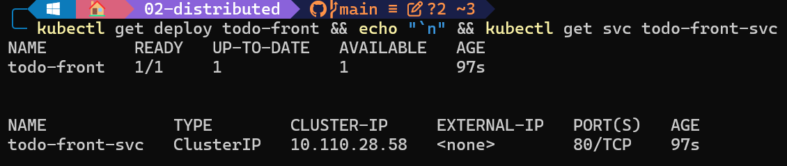
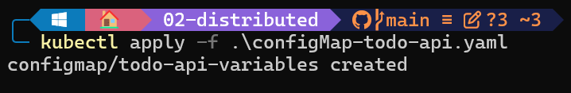
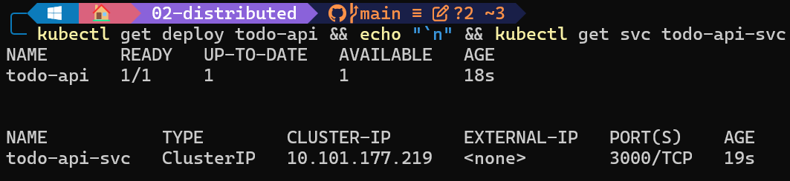
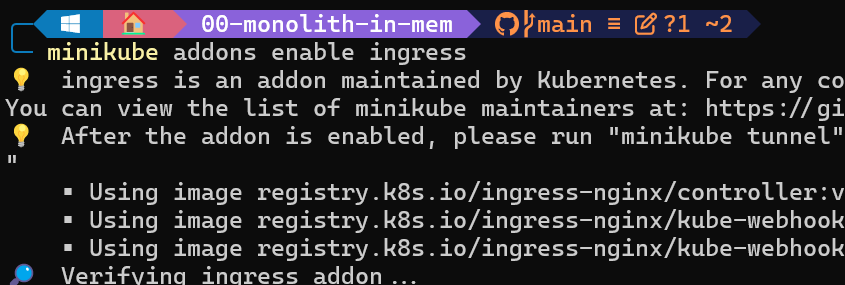
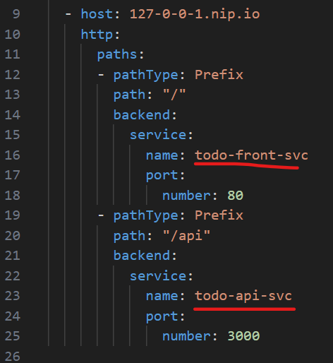
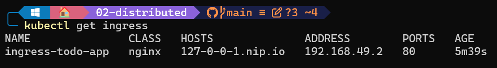
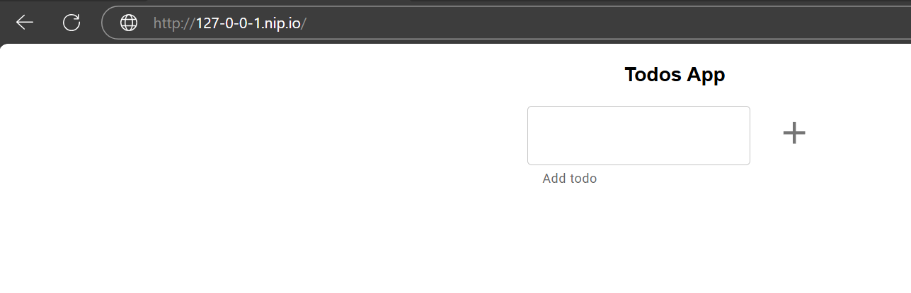

# Ingress

## Enunciado

Construir los distintos recursos de Kubernetes para generar un clúster, como el de la siguiente imagen:

```diff
+ ### PROPUESTA EJERCICIO DE DISTRIBUTED
```
1. Creación de deployment y servicio del "todo-front" en `todo-front.yaml` para ello se juntaron en un solo yaml el `deployment` y `service` de tipo ClusterIP exponiendo el puerto `80`. Se usó la imagen `lemoncodersbc/lc-todo-api:v5-2024` y se aplicó con el comando:
```bash
kubectl apply -f todo-front.yaml
```
<p align="center">
    
</p>

2. Creación de deployment y servicio del "todo-api" primeramente se debe crear un configMap con la variables de entorno necesarias en `configMap-todo-api.yaml` y en `todo-api.yaml`hacer referencia a ese `configMap` y también se juntó en un solo yaml el `deployment` y `service` de tipo ClusterIP exponiendo el puerto `3000`. 

Aplicación del `configMap`
```bash
kubectl apply -f configMap-todo-api.yaml
```
<p align="center">
    
</p>

```bash
kubectl apply -f todo-api.yaml
```
<p align="center">
    
</p>

3. Habilitar el objeto Ingress siguiendo la guía proporicionada de añadirlo a minikube `minikube addons enable ingress`
<p align="center">
    
</p>

4. Crear el manifiesto YAML de `ingress.yaml` apuntado a las etiqutas correctasa del servicio para que haga bien la redirección.

<p align="center">
    
</p>

5. finalmente hacer un comando `minikube tunnel` para poder visualizar el resultado por el navegador, para ello debido a que hace falta un "hostname" entonces se usa la solución de `127-0-0-1.nip.io` que nos devolverá la resolución a localhost.

Resultados finales de la operación.
<p align="center">
    
</p>

<p align="center">
    
</p>